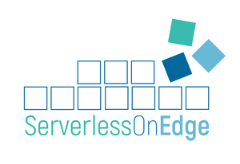
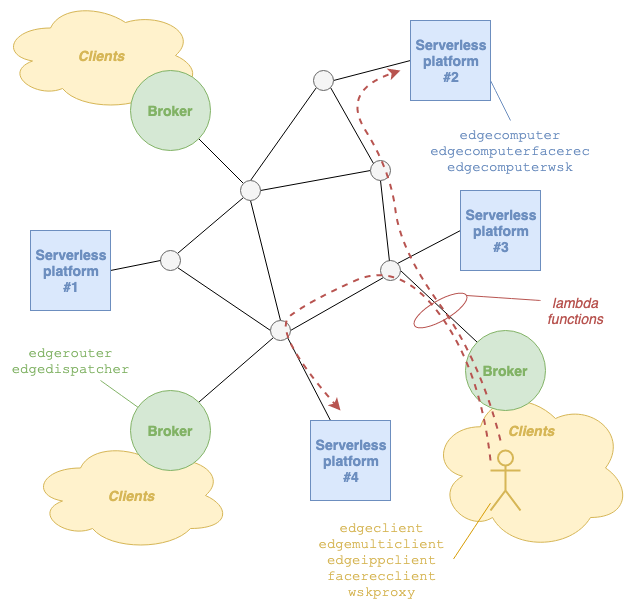

A decentralized framework for the distribution of lambda functions, in a Function-as-a-Service (FaaS) model, to multiple serverless platforms.

The reference system is depicted in the figure below.

- The _clients_ are end-user applications wishing to execute stateless tasks.
- The _serverless platforms_ are systems that can execute tasks upon receiving a lambda function execution request. It is not required that these platforms interact with one another.
- The _brokers_ are the entry point of clients in the system: they forward every incoming lambda function to the serverless platform that is deemed to be the best choice at any given point in time. Like serverless platforms, the brokers do not communicated with another. However, they must be notified of the existence of serverless platforms (and which lambda functions they can use), which can be done by a so-called _edge controller_ not depicted in the figure above.

The components communicate with one another via Google's [gRPC](https://grpc.io/).
An alternative, there is experimental support of [QUIC](https://quicwg.org/) using Facebook's [proxygen](https://github.com/facebook/proxygen) and [mvfst](https://github.com/facebookincubator/mvfst).

## Components

For each of the components there are different versions, illustrated below.

###  Broker

- `edgerouter`: implements the e-router concept described [here](https://ccicconetti.github.io/cloudcom2018.html), where every broker has a table of possible destinations with an associated weight corresponding to the response delay, and the next destination is selected according to one of several policies.
- `edgedispatcher`: implements the dispatcher concept described [here](https://ccicconetti.github.io/percom2019.html), where the broker selects the destination that minimizes the response delay, based on a predictions.

### Serverless platform

- `edgecomputer`: simulates a serverless platform with given characteristics (CPU speed, memory, number of containers, etc) and task properties (e.g., memory and operations requested)/
- `edgecomputerfacerec`: performs face/eyes detection in 2D images using [OpenCV](https://opencv.org/)/
- `edgecomputerwsk`: acts as proxy towards an Apache OpenWhisk platform hosted elsewhere, see below.

### Client

- `edgeclient`: continually executes lambda functions with a given name and content; the intertime between consecutive requests can be drawn from uniform or exponential random variables; multiple threads can be spawn with same characteristics.
- `edgemulticlient`: create a pool of clients issuing lambda requests in accordance with a timetable generated by `clienttracegen`.
- `edgeippclient`: create a pool of clients issuing lambda requests with an ON/OFF pattern with given characteristics.
- `facerecclient`: requests detection of face (optionally also eyes) in pictures; can use a real-time stream from camera.
- `wskproxy`: acts as a proxy from Apache OpenWhisk clients (only for actions), see below.

## Integration with ETSI MEC

[ETSI MEC](https://www.etsi.org/technologies/multi-access-edge-computing) is a set of specifications, under definition in the Industry Study Group MEC of the European Telecommunications Standards Institute, aimed at defining a reference architecture and open APIs for the deployment and lifecycle management of vendor-neutral applications in edge networks of telecom operators.

We have implemented a partial integration of our _Serverless on Edge_ framework with the ETSI MEC, specifically with the `Mx2` interface. More information can be found in the [dedicated GitHub repository](https://github.com/ccicconetti/etsimec), which is added as a sub-module to this one.

This project is listed as one of the MEC Solutions in the [ETSI MEC ecosystem wiki page](https://mecwiki.etsi.org/index.php?title=MEC_Ecosystem).

## Integration with Apache OpenWhisk

[Apache OpenWhisk](https://openwhisk.apache.org/) is a distributed serverless platforms that realizes the FaaS model by executing functions in response to events of different types, called actions, triggers, and feeds.

We have integrated partially our _Serverless on Edge_ framework by means of two components, called `edgecomputerwsk` and `wskproxy`, which allow actions issued by clients to be executed on OpenWhisk platforms. 

If interested check out more details and instructions [here](docs/openwhisk_integration.md).

## Building

See [building instructions](docs/BUILDING.md).

### Examples

Step-by-step execution of examples:

- [main system components](docs/example.md): edgecomputer, edgerouter, and edgecontroller, with stateless single function invocations
- [stateful function chains](docs/example-chain.md)
- [SSL/TLS gRPC support](docs/example-secure.md)

### Performance evaluation

The ServerlessOnEdge framework has been evaluated extensively in an emulated environment using [mininet](http://mininet.org/).

The scenarios used, together with the scripts for setting up the environment and post-processing the results, are available, see the [experiments page](experiments/README.md).

## Code quality

The source code is written in C++-17.
The master branch is subject to a continuous integration process supervised by a Jenkins service running in the [Ubiquitous Internet research group](http://cnd.iit.cnr.it/) infrastructure, which verifies zero-warning compilation with GNU gcc 7.5.0 and LLVM clang 10.0.0, as well as the absence of warnings by [cppcheck v2.3](http://cppcheck.sourceforge.net/).
The source code is formatted automatically with clang-format-10 using the `.clang-format` schema shipped in this repository.
Unit tests with [GoogleTest](https://github.com/google/googletest) are provided for all the core components, though we do not aim at full coverage.
Despite all our efforts, it is possible that the software contains bugs, has performance issues, and exposes security flaws: _this code is intended for experimentation purposes only and it should never be used in a production system_.

## StateSim

The repository also includes a stand-alone simulator of the execution/network latency of chain of stateful invocations in an edge network, check the [StateSim page](StateSim/README.md) for more details.

## Credits

- Chiara Spinelli ([twitter](https://twitter.com/chiarapeggy) / [instagram](https://www.instagram.com/chiarapeggy/)): logo artwork
