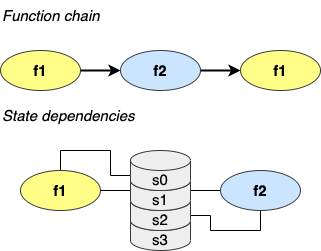
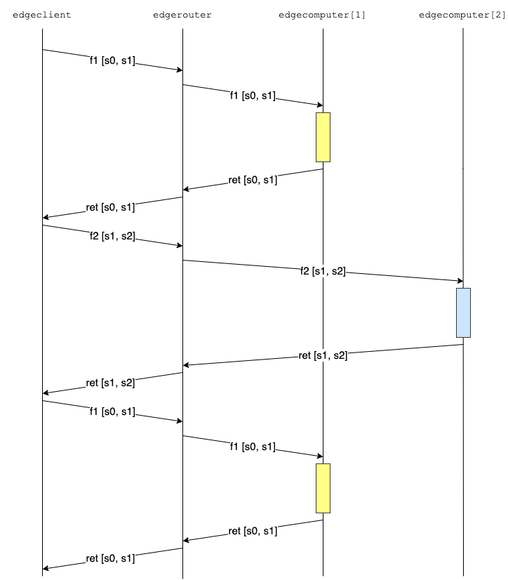

# Function chain examples

The examples refer to the following scenario:



where the client wishes to invoke a chain of stateful functions: _f1_ and _f2_ are the function names, while _s0_, _s1_, _s2_, and _s3_ are the pieces of the application's state.

## Client-based chain invocation

In the first example we let the client invoke the functions in the chain using the `edgeclient` command-line utility.

First we run:

```
./edgeclient --chain-conf type=make-template
```

that generates the following file `chain-example.json` that describes the function chain, as illustrated above, and the size of the application states, in bytes.
```
{
  "functions" : [ "f1", "f2", "f1" ],
  "dependencies" :
    {
    "s0" : [ "f1" ],
    "s1" : [ "f1", "f2" ],
    "s2" : [ "f2" ],
    "s3" : null
    },
  "state-sizes" :
    {
    "s0" : 10000,
    "s1" : 20000,
    "s2" : 30000,
    "s3" : 40000
    }
}
```

This mode operates by embedding the states needed in each function call. Note that since no function depends on state _s3_ it is not embedded in any function call.

The sequence diagram is the following:



Before running `edgeclient` we need to set up the environment, i.e., to launch the e-computers, e-router, and e-controller. This can be done by the running script `stateful-1.sh` (assuming we are in `build/debug/Executables`):

```
../../../docs/examples/stateful-1.sh
```

that gives the following output and waits for the user to press a key to clean up (don't do this until you have run the client):

```
press any key to kill all the processes spawned
```

In another shell we can now run the client, e.g.:

```
./edgeclient \
  --chain-conf type=file,filename=chain-example.json \
  --max-requests 1 \
  --server-endpoint 127.0.0.1:6473
```

which gives for instance the following output:

```
I1026 09:17:35.616434 25095 edgeclientmain.cpp:146] operating in function chain mode, overriding the lambda name: clambda0
I1026 09:17:35.618954 25095 client.cpp:77] created a client with seed (0,0), which will send max 1 requests to 127.0.0.1:6473, function chain mode
0.110854 0.107316 0  f1-f2-f1 6
I1026 09:17:35.728235 25095 edgeclientmain.cpp:211] latency 0.107316 +- 0
I1026 09:17:35.728682 25095 edgeclientmain.cpp:214] processing 0.081 +- 0
```

You can notice that the processing time is 81 ms, which is 3 times the processing time of either _f1_ or _f2_, i.e., 27 ms, with this configuration.