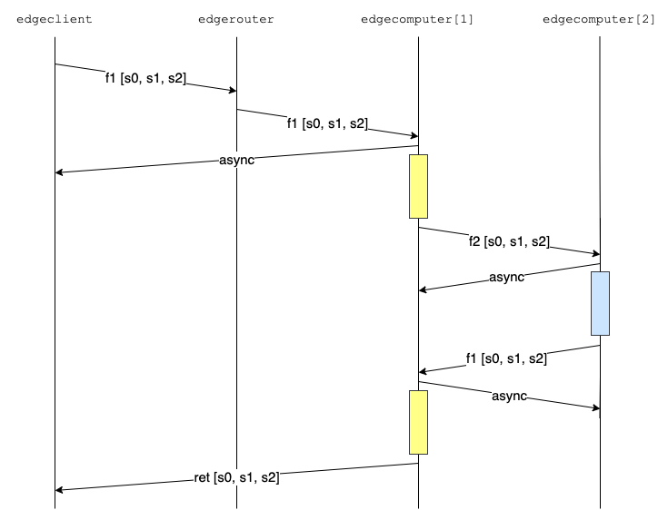

# Function chain examples

The examples refer to the following scenario:


where the client wishes to invoke a chain of stateful functions: _f1_ and _f2_ are the function names, while _s0_, _s1_, _s2_, and _s3_ are the pieces of the application's state.

## Client-based chain invocation

In the first example we let the client invoke the functions in the chain using the `edgeclient` command-line utility.

First we run:

```
./edgeclient --chain-conf type=make-template
```

that generates the following file `chain-example.json` that describes the function chain, as illustrated above, and the size of the application states, in bytes.
```
{
  "functions" : [ "f1", "f2", "f1" ],
  "dependencies" :
    {
    "s0" : [ "f1" ],
    "s1" : [ "f1", "f2" ],
    "s2" : [ "f2" ],
    "s3" : null
    },
  "state-sizes" :
    {
    "s0" : 10000,
    "s1" : 20000,
    "s2" : 30000,
    "s3" : 40000
    }
}
```

This mode operates by embedding the states needed in each function call. Note that since no function depends on state _s3_ it is not embedded in any function call.

The sequence diagram is the following:


Before running `edgeclient` we need to set up the environment, i.e., to launch the e-computers, e-router, and e-controller. This can be done by the running script `chain-1.sh` (assuming we are in `build/debug/Executables`):

```
../../../docs/examples/chain-1.sh
```

that gives the following output and waits for the user to press a key to clean up (don't do this until you have run the client):

```
prepare configuration files
start the e-controller
start the e-computers
start the e-router
print e-router table
Table#0 f1 [1] 127.0.0.1:10001 (F) f2 [1] 127.0.0.1:10002 (F) Table#1 f1 [1] 127.0.0.1:10001 (F) f2 [1] 127.0.0.1:10002 (F)
```

In another shell we can now run the client, e.g.:

```
./edgeclient \
  --chain-conf type=file,filename=chain-example.json \
  --max-requests 1 \
  --server-endpoint 127.0.0.1:6473
```

which gives for instance the following output:

```
I1026 09:17:35.616434 25095 edgeclientmain.cpp:146] operating in function chain mode, overriding the lambda name: clambda0
I1026 09:17:35.618954 25095 client.cpp:77] created a client with seed (0,0), which will send max 1 requests to 127.0.0.1:6473, function chain mode
0.110854 0.107316 0  f1-f2-f1 6
I1026 09:17:35.728235 25095 edgeclientmain.cpp:211] latency 0.107316 +- 0
I1026 09:17:35.728682 25095 edgeclientmain.cpp:214] processing 0.081 +- 0
```

You can notice that the processing time is 81 ms, which is 3 times the processing time of either _f1_ or _f2_, i.e., 27 ms, with this configuration.


## Hop-by-hop chain invocation

In the second example we let the client invoke the full chain of functions, using the `edgeclient` command-line utility again. However, this time we will have to specify the `--callback` function that creates a `CallbackServer` in the client to receive asynchronous responses.

This mode operates by embedding the states needed in each function call, which is then invoked from one e-computer to the next one. Note that since no function depends on state _s3_ it is not embedded in the message at all.

The sequence diagram is the following:



For better readability in the diagram above we have not shown the interactions between the e-computers and their `companion` e-routers: to support this hop-by-hop invocation an e-computer has to direct the next function in the chain to another e-computer, which is identified by its companion e-router, configured upon starting the service.

To set up the environment, i.e., to launch the e-computers, e-router, and e-controller, we can run the script `chain-2.sh` (assuming we are in `build/debug/Executables`):

```
../../../docs/examples/chain-2.sh
```

which gives the same output as in the first example.

Before executing the function chain, let us experiment with asynchronous function calls. This command will request the execution of function _f1_ directly from the client on the e-computer listening on port 10001 in synchronous mode (default):

```
GLOG_v=3 ./edgeclient \
  --lambda f1 \
  --size 13 \
  --server 127.0.0.1:10001 \
  --max-requests 1
```

We have raised the verbosity level to see all the messages sent and received in the output, which includes:

```
name: f1, from edge client, hops: 0, input: {"input":"A"}, datain size: 0
f1, took 10.4376 ms, return retcode: OK, from: , ptime: 5 ms, hops: 1, load: 0/0/0, output: {"input":"A"}, dataout size: 0
```

Thus, the call request has been answered with the response. If we add a `--callback` argument, the client will request an asynchronous invocation:

```
GLOG_v=3 ./edgeclient \
  --lambda f1 \
  --size 13 \
  --server 127.0.0.1:10001 \
  --max-requests 1 \
  --callback 127.0.0.1:6480
```

which gives a slightly different output (filtered):

```
name: f1, from edge client, callback 127.0.0.1:6480, hops: 0, input: {"input":"A"}, datain size: 0
postponed response indication received, retcode: OK, asynchronous
async response received, retcode: OK, from: 127.0.0.1:10001, ptime: 0 ms, hops: 1, load: 0/0/0, output: {"input":"A"}, dataout size: 0
f1, took 12.1918 ms, return retcode: OK, from: 127.0.0.1:10001, ptime: 0 ms, hops: 1, load: 0/0/0, output: {"input":"A"}, dataout size: 0
```

where you can see that the client receives first a `postponed response indication` and only after that the asynchronous response, which includes the output of _f1_.

We are now ready to invoke the full chain (after having create the function chain JSON description like in the first example with `./edgeclient --chain-conf type=make-template`):

```
./edgeclient  \
  --chain-conf type=file,filename=chain-example.json \
  --max-requests 1  \
  --server-endpoint 127.0.0.1:6473 \
  --callback 127.0.0.1:6480
```

which produces the following example output:

```
I1027 10:53:32.166568 38407 edgeclientmain.cpp:213] operating in function chain mode, overriding the lambda name: clambda0
I1027 10:53:32.166858 38407 callbackserver.cpp:62] Creating a callback server at endpoint 127.0.0.1:6480
I1027 10:53:32.169615 38407 simpleserver.cpp:62] Server listening on 127.0.0.1:6480
I1027 10:53:32.171103 38407 client.cpp:79] created a client with seed (0,0), which will send max 1 requests to 127.0.0.1:6473, function chain mode
I1027 10:53:32.171430 38407 client.cpp:343] setting the callback end-point to 127.0.0.1:6480
0.0988433 0.0963982 0 127.0.0.1:10001 f1-f2-f1 3
I1027 10:53:32.269821 38407 edgeclientmain.cpp:292] latency 0.0963982 +- 0
I1027 10:53:32.270215 38407 edgeclientmain.cpp:295] processing 0 +- 0
```