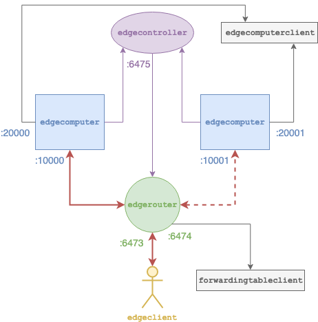

# Example

After having built the framework, you may start by deploying the following example (the numbers represent the listening TCP ports).



Let us ignore for the moment the gray components, i.e., `edgecomputerclient` and `forwardingtableclient`.

You have to open 5 shells and execute the following commands in each, assuming that all the shells have been opened on the same host, there are no other applications bound to these ports, and that the current working directory contains the executables, e.g., if you have build in debug it is `build/debug/Executables` from the git repo root.

First, launch the controller, which will listen to `6475`:

```
./edgecontroller --server 127.0.0.1:6475
```

Then launch the two edge computers (with default characteristics, which creates two lambda functions `clambda0` and `glambda0` executed on containers with different CPU speed) and connect them to the controller:

```
./edgecomputer --server 127.0.0.1:10000 \
               --utilization 127.0.0.1:20000 \
               --controller 127.0.0.1:6475
```

and

```
./edgecomputer --server 127.0.0.1:10001 \
               --utilization 127.0.0.1:20001 \
               --controller 127.0.0.1:6475
```

Then launch the edge router and connect it to the controller, as well:

```
./edgerouter --server 127.0.0.1:6473 \
			   --configuration 127.0.0.1:6474 \
			   --controller 127.0.0.1:6475
```

At this point the system is up and ready and accepts execution of lambda functions both directly on the edge computer (if issues to end-points on port 10000 or 10001) and on the edge router (at port 6473). We then launch a client and ask to execute 10 tymes the same function `clambda0` with size 10000 bytes every second:

```
./edgeclient --lambda clambda0 \
		      --server 127.0.0.1:6473 \
		      --inter-request-time 1 \
		      --max-requests 5
```

An example of output is the following:

```
1.11078 0.109332 0 127.0.0.1:10001 clambda0 2
2.11141 0.107049 0 127.0.0.1:10000 clambda0 2
3.11257 0.110859 0 127.0.0.1:10001 clambda0 2
4.10905 0.105978 0 127.0.0.1:10000 clambda0 2
5.11009 0.107862 3 127.0.0.1:10000 clambda0 2
I0226 14:48:27.862442 265811392 edgeclientmain.cpp:188] latency 0.108216 +- 0.00171617
I0226 14:48:27.863188 265811392 edgeclientmain.cpp:191] processing 0.1058 +- 0.00172047
```

The output reports:

- a timestamp, in seconds;
- the response time, in seconds;
- the load reported by the edge computer, in percentage;
- the end-point of the edge computer that has executed the lambda function: you may notice that the edge route is balancing between the two edge computers;
- the lambda function name;
- the number of hops to reach the edge computer (client -- edge router + edge router -- edge computer).

For all components verbosity can be increased by specifing the environment variable `GLOG_v=X`, with `X` 1 or greater, since [glog](https://github.com/google/glog) is used for logging.

The current state of the weights in the edge routers can be queried (via gRPC) as follows:

```
./forwardingtableclient --server 127.0.0.1:6474
```

Example of ouput:

```
Table#0
clambda0 [0.106305] 127.0.0.1:10000 (F)
         [0.108944] 127.0.0.1:10001 (F)
glambda0 [1       ] 127.0.0.1:10000 (F)
         [1       ] 127.0.0.1:10001 (F)
Table#1
clambda0 [1] 127.0.0.1:10000 (F)
         [1] 127.0.0.1:10001 (F)
glambda0 [1] 127.0.0.1:10000 (F)
         [1] 127.0.0.1:10001 (F)
```

The current load of the edge computers can be queried (again, via gRPC) as follows, for instance on the first edge computer:

```
./edgecomputerclient --server 127.0.0.1:20000
```

Example of output while idle:

```
0.60116 bm2837 0.000000
0.601225 arm 0.000000
1.60027 bm2837 0.000000
1.6003 arm 0.000000
2.60552 bm2837 0.000000
2.60557 arm 0.000000
```

Note that there are two lines per second, since in its default configuration the edge computer simulates two CPUs (called `arm` and `bm2837`), each hosting one container. By issuing `clambda0` only `arm` is used.

Example of output while running an edge client as before:

```
0.35004 bm2837 0.000000
0.350097 arm 0.107947
1.35395 bm2837 0.000000
1.35399 arm 0.133199
2.35423 bm2837 0.000000
2.35427 arm 0.128262
```

The same example can be executed, for instance, launching:

- `edgedispatcher` instead of `edgerouter`;
- `OpenCV/facerecclient` instead of `edgeclient` and `edgecomputerfacerec` instead of `OpenCV/edgecomputer`, though the latter requires to download suitable models from [OpenCV repositories](https://github.com/opencv).
